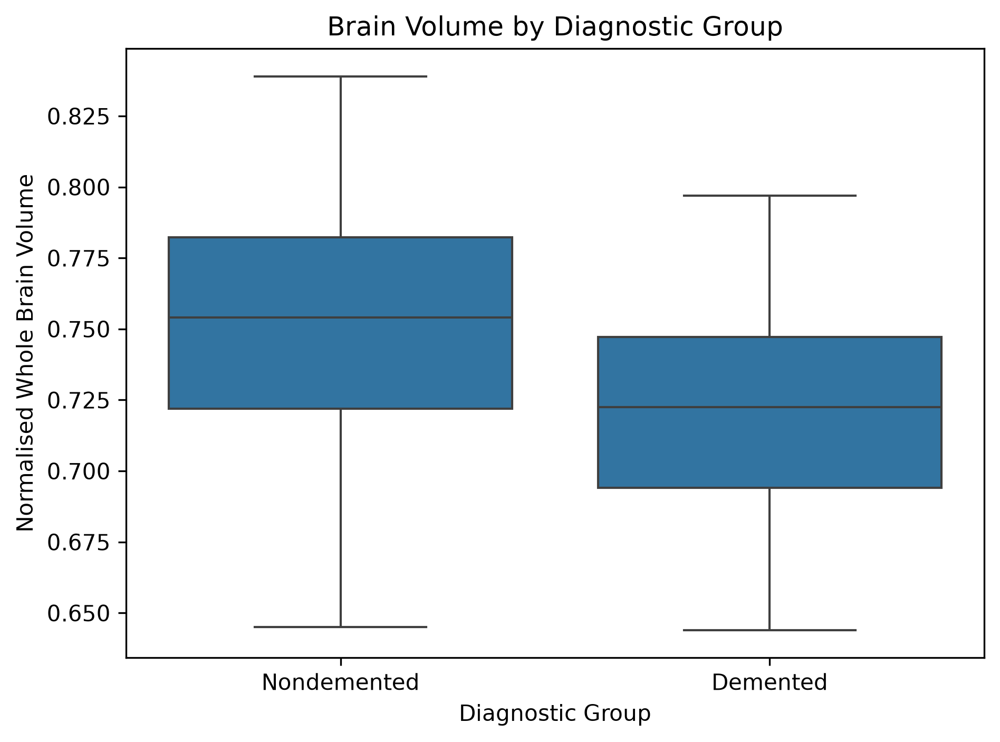
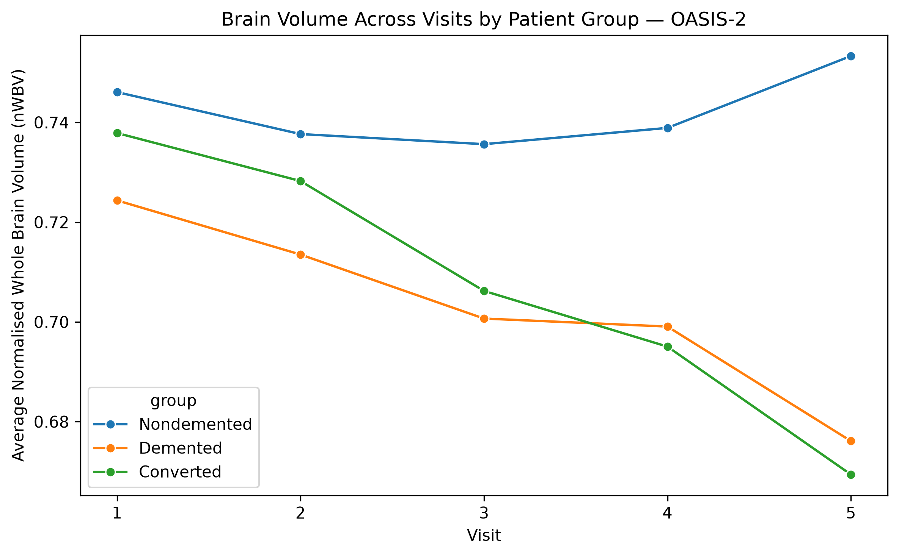
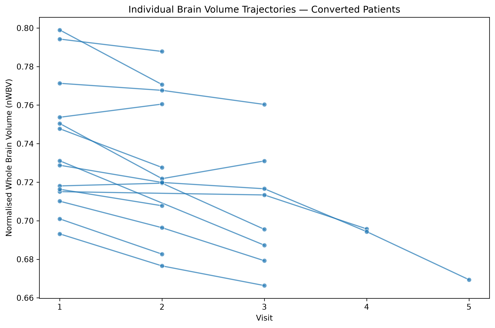

# Alzheimer's Disease Brain Volume Analysis

## Overview

An end-to-end clinical data pipeline investigating whether **normalised whole brain volume (nWBV)** measured from MRI scans 
declines faster in patients who develop Alzheimer's disease compared to those who remain cognitively healthy.

Built using real patient data from the OASIS study, this project mirrors the core responsibilities of a clinical data integration role — ETL pipeline development, structured data management, SQL-based analysis, and communicating findings to both technical and non-technical audiences.

Using the **OASIS-1 cross-sectional dataset** and the **OASIS-2 longitudinal dataset**, I built an end-to-end data analysis workflow combining:

- Python data cleaning
- Exploratory data analysis
- SQL querying with SQLite
- Cross-sectional patient comparisons
- Longitudinal patient tracking
- Data visualisation with Matplotlib and Seaborn

The project was designed around a clinical question rather than simply exploring variables:

> **Do patients with dementia or those who later convert to dementia show lower brain volume or greater brain-volume decline than patients who remain cognitively healthy?**

---

## Project Objectives

The analysis focused on four main questions:

1. Do demented patients have lower normalised whole brain volume than nondemented patients?
2. Are cognitive scores such as MMSE also different between diagnostic groups?
3. Do patients who convert to dementia show greater brain-volume decline over time?
4. Can changes in brain volume be observed before or around changes in clinical dementia rating?

---

## Key Findings

**OASIS-1 — Snapshot Analysis**
- Demented patients showed lower average brain volume (0.7220) compared to nondemented patients (0.7525)
- Cognitive scores were consistently lower in demented patients (MMSE 24.3 vs 29.0)
- Average ages were similar between the groups (76.8 vs 75.9), reducing the likelihood that the observed group difference was driven simply by a large difference in mean age.
- Brain volume difference held across both male and female patients

**OASIS-2 — Longitudinal Analysis**
- Converted patients lost the most brain volume across the study period (average decline 0.0237) compared to nondemented patients (0.0143) — nearly double
- Brain volume in converted patients declined from 0.7379 at visit 1 to 0.6694 by visit 5
- Individual patient data shows brain volume declining in visits prior to CDR score changing from 0 to 0.5, suggesting neurodegeneration may precede formal clinical classification
- Most conversions occurred between visits 2 and 3 at average ages of 78 to 82

---

# Data

The project uses data from the **Open Access Series of Imaging Studies (OASIS)**.

## Why I Used Both OASIS-1 and OASIS-2

The two datasets were used because they answer different parts of the research question.

**OASIS-1** is cross-sectional, so it was used to compare demented and nondemented participants at a single point in time. This helped assess whether brain volume and cognitive scores differed between diagnostic groups.

**OASIS-2** is longitudinal, meaning the same participants were followed across multiple visits. This made it possible to investigate how brain volume and cognitive scores changed over time, particularly in patients who later converted to dementia.

## Why Datasets Were Kept Separate
Combining OASIS-1 and OASIS-2 would introduce structural imbalance 
— OASIS-1 has one row per patient while OASIS-2 has multiple rows 
per patient. Additionally, data was collected at different time 
periods on different MRI hardware, introducing potential batch 
effects. Each dataset was used for what it is best suited for.

### OASIS-1
Cross-sectional MRI data were used to compare characteristics of demented and nondemented participants at a single point in time.

Variables analysed included:

- Age
- Gender
- Education
- Socioeconomic status
- MMSE score
- Clinical Dementia Rating (CDR)
- Estimated Total Intracranial Volume (eTIV)
- Normalised Whole Brain Volume (nWBV)

### OASIS-2
Longitudinal MRI data were used to follow participants across multiple clinical visits.

This made it possible to investigate changes in:

- Brain volume
- MMSE score
- Clinical dementia rating
- Diagnostic group
- Patient progression over time

The raw OASIS datasets are **not included in this repository**. They must be obtained separately from the OASIS data source.

---
## Tools Used
- Python 3
- pandas
- SQLite3
- Matplotlib
- Seaborn
- Jupyter Notebooks (VSCode)

---

## Analysis Workflow

The project follows a structured data pipeline:

## Analysis Workflow

The project follows a structured data pipeline:

**Raw OASIS Data**  
        ↓  
**Data Cleaning with Pandas**  
        ↓  
**Cleaned CSV Files**  
        ↓  
**SQLite Database**  
        ↓  
**SQL Analysis**  
        ↓  
**Exploratory Data Analysis**  
        ↓  
**Cross-sectional & Longitudinal Analysis**  
        ↓  
**Visualisation & Interpretation**

## Key Visualisations

### Brain Volume by Diagnostic Group

### Longitudinal Brain Volume Changes

### Converted Patient Trajectories

## Findings

- **Lower brain volume in dementia:** OASIS-1 participants in the demented group had lower average nWBV (0.7220) than nondemented participants (0.7525).
- **Lower cognitive scores:** Average MMSE was approximately 24.3 in the demented group compared with 29.0 in the nondemented group.
- **Greater longitudinal decline:** In OASIS-2, converted patients showed the greatest average total decline in nWBV (0.0237), compared with demented (0.0153) and nondemented (0.0143) participants.
- **Individual trajectories:** Several converted-patient trajectories showed decreasing brain volume across repeated visits, supporting further investigation of structural change around clinical conversion.

These findings are exploratory and should not be interpreted as demonstrating that brain-volume decline independently predicts Alzheimer's disease.
