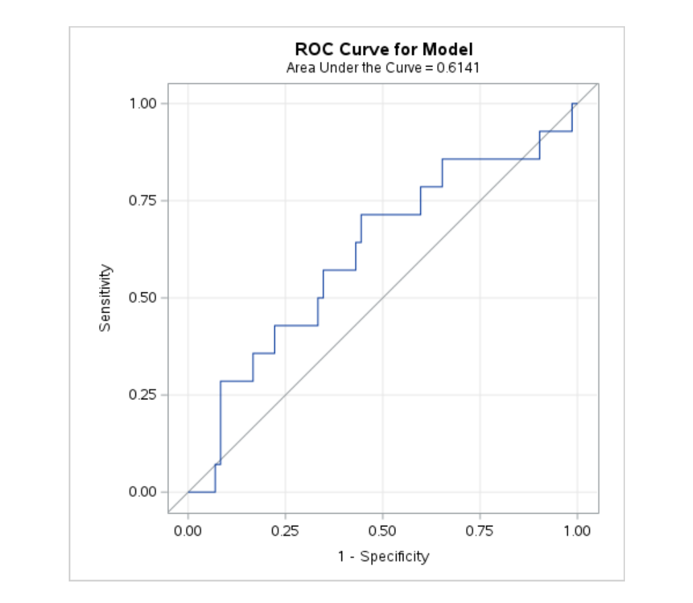

# SAS Extension: Baseline Predictors of Dementia Conversion

## Overview

This analysis extends the existing **OASIS Alzheimer's Disease Data Analysis** project by applying SAS to the longitudinal OASIS-2 dataset.

While the original project focused on data cleaning, exploratory analysis, brain-volume comparisons and longitudinal trends using Python and SQL, this extension investigates a new question:

> **Can baseline cognitive and neuroimaging characteristics help distinguish participants who subsequently convert to dementia from those who remain nondemented?**

The purpose of this extension was also to demonstrate practical SAS programming through cohort construction, `PROC SQL`, macro programming, logistic regression and ROC analysis.

---

## Dataset

The analysis used the longitudinal **OASIS-2** dataset.

The working dataset contained:

- **373 longitudinal records**
- **86 participants** included in the baseline conversion analysis
- **14 participants** who subsequently converted to dementia
- **72 participants** who remained nondemented

Participants who were already classified as demented at baseline were excluded because the objective was specifically to investigate **subsequent dementia conversion**.

Only the first recorded visit (`Visit = 1`) was used to construct the baseline analysis cohort.

---

## Analysis Question

The analysis investigated whether the following measurements collected at baseline were associated with subsequent dementia conversion:

- **Age**
- **MMSE** — Mini-Mental State Examination score
- **nWBV** — normalized whole-brain volume

The outcome was coded as:

- `1` = subsequently converted to dementia
- `0` = remained nondemented

---

## SAS Workflow

The SAS workflow consisted of the following stages.

### 1. Baseline Cohort Construction

`PROC SQL` was used to transform the longitudinal dataset into a subject-level baseline cohort containing only first-visit records for participants classified as either:

- `Converted`
- `Nondemented`

This reduced **373 longitudinal records** to an **86-participant baseline analytical cohort**.

### 2. Outcome Creation

A binary dementia-conversion variable was created using a SAS `DATA` step:

```sas
if group = "Converted" then converted = 1;
else if group = "Nondemented" then converted = 0;
```

### 3. Descriptive Analysis

`PROC MEANS` was used to compare baseline age, MMSE and normalized whole-brain volume between the two groups.

### 4. SAS Macro Programming

A reusable SAS macro was created to automate repeated logistic-regression analyses across multiple predictors:

```sas
%macro test_predictor(variable);

    proc logistic data=baseline;
        model converted(event='1') = &variable;
    run;

%mend;
```

The macro was applied to:

```sas
%test_predictor(age);
%test_predictor(mmse);
%test_predictor(nwbv);
```

This allowed the same analytical workflow to be reused without rewriting the logistic-regression procedure for each predictor.

### 5. Logistic Regression

`PROC LOGISTIC` was used to evaluate dementia-conversion status.

The final exploratory model included:

- baseline MMSE
- baseline normalized whole-brain volume

### 6. ROC Analysis

Model discrimination was evaluated using a Receiver Operating Characteristic (ROC) curve and Area Under the Curve (AUC).

---

## Baseline Characteristics

| Measure | Converted | Nondemented |
|---|---:|---:|
| Participants | 14 | 72 |
| Mean age | 77.071 | 75.431 |
| Mean MMSE | 29.357 | 29.194 |
| Mean nWBV | 0.738 | 0.746 |

Participants who subsequently converted to dementia had slightly lower mean normalized whole-brain volume at baseline, while baseline MMSE values were very similar between the groups.

---

## Logistic Regression Results

### Age

In the individual age model:

- **Odds Ratio:** 1.026
- **p-value:** 0.488

Age was not statistically significantly associated with conversion status in this cohort.

### Final MMSE + nWBV Model

| Predictor | Estimate | p-value |
|---|---:|---:|
| MMSE | 0.2683 | 0.4783 |
| nWBV (per 0.01-unit scale) | -0.0642 | 0.4233 |

Overall model:

- **Likelihood Ratio p-value:** 0.5761
- **ROC AUC:** 0.6141

Neither baseline MMSE nor nWBV showed a statistically significant association with subsequent dementia conversion in the final exploratory model.

---

## nWBV Rescaling

The original nWBV values are approximately 0.7, meaning that interpreting an odds ratio for a full **1.0-unit increase** would not be meaningful.

For improved interpretability, nWBV was rescaled:

```sas
nwbv_01 = nwbv * 100;
```

One unit of `nwbv_01` therefore represents a **0.01-unit increase in the original nWBV measurement**.

This changes the scale used to express the regression coefficient and odds ratio but does not change the underlying model predictions or ROC AUC.

---

## ROC Curve

The final MMSE + nWBV model produced an:

**ROC AUC = 0.6141**



An AUC of 0.614 indicates that the model demonstrated **limited discrimination** between participants who subsequently converted to dementia and those who remained nondemented.

The result is exploratory and should be interpreted cautiously because only **14 conversion events** were available.

---

## Interpretation

The analysis did not identify strong baseline predictors of dementia conversion within this small cohort.

Although the converted group showed slightly lower normalized whole-brain volume at baseline, neither nWBV nor MMSE reached statistical significance in the logistic-regression model.

Rather than demonstrating a clinically useful prediction model, this analysis shows how longitudinal health data can be transformed into a baseline analytical cohort and evaluated using reproducible statistical methods in SAS.

The limited predictive performance also highlights the importance of:

- adequate sample size
- sufficient numbers of outcome events
- careful model interpretation
- avoiding overstatement of exploratory findings

---

## SAS Skills Demonstrated

This extension demonstrates practical use of:

- SAS programming
- `PROC IMPORT`
- `PROC CONTENTS`
- SAS `DATA` steps
- `PROC SQL`
- `PROC MEANS`
- SAS macro programming
- `PROC LOGISTIC`
- binary logistic regression
- odds-ratio interpretation
- ROC curve analysis
- AUC interpretation
- longitudinal-to-baseline cohort construction

---

## Project Files

```text
sas_extension/
│
├── oasis_conversion_analysis.sas
├── oasis_conversion_roc.png
└── README.md
```

### `oasis_conversion_analysis.sas`

Contains the complete SAS workflow, including:

- baseline cohort construction
- outcome coding
- descriptive statistics
- reusable predictor macro
- logistic regression
- nWBV rescaling
- ROC analysis

### `oasis_conversion_roc.png`

ROC curve generated from the final exploratory logistic-regression model.

---

## Key Takeaway

Using SAS, **373 longitudinal OASIS records were transformed into an 86-participant baseline cohort**, including **14 subsequent dementia converters and 72 persistently nondemented participants**.

A SAS macro automated evaluation of **3 baseline predictors**, followed by logistic regression and ROC analysis to investigate dementia conversion.

The final exploratory model produced an **AUC of 0.614**, indicating limited predictive discrimination and demonstrating the importance of appropriately interpreting statistical results from small clinical datasets.

---

## Disclaimer

This project is an exploratory portfolio analysis designed to demonstrate SAS programming, clinical-data handling and statistical-analysis skills.

It is **not a clinically validated dementia prediction model** and should not be used for medical decision-making.

---

[← Return to the main OASIS Alzheimer's Disease Analysis](../README.md)
